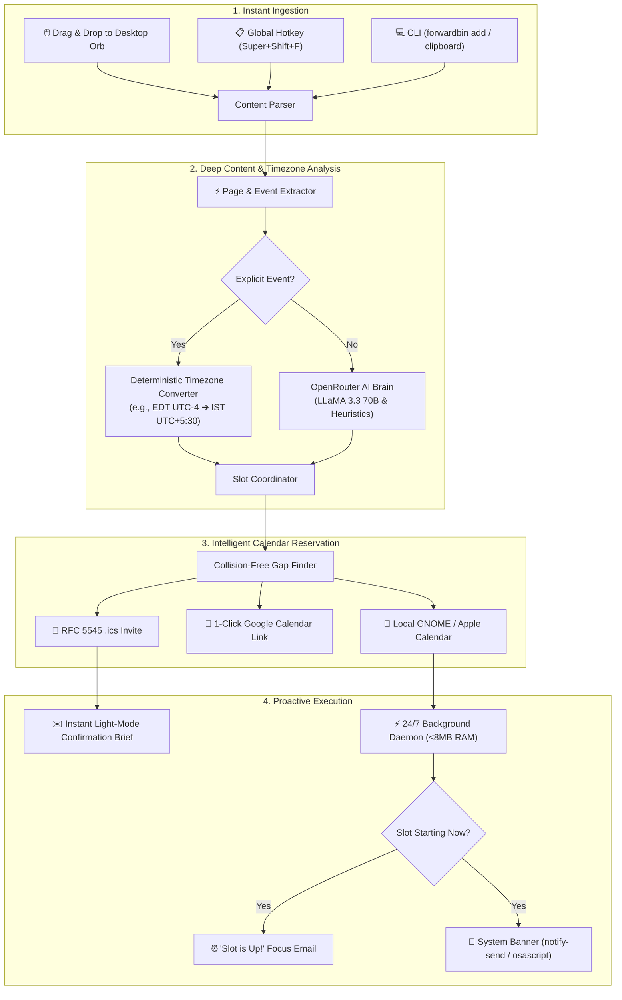

<p align="center">
  
</p>

<h1 align="center">ForwardBin Jarvis</h1>

<p align="center">
  <strong>Your Intelligent Desktop Drop Bin & AI-Powered Calendar Slot Scheduler</strong><br>
  <em>Hybrid Architecture: Blazing Native Rust Engine + Composited Translucent Desktop Widget</em>
</p>

<p align="center">
  <a href="https://www.rust-lang.org/"></a>
  <a href="https://www.python.org/"></a>
  <a href="https://www.kernel.org/"></a>
  <a href="https://www.apple.com/macos/"></a>
  <a href="LICENSE"></a>
</p>

<p align="center">
  
  
  
  
  
  
</p>

---

## 🌟 What is ForwardBin?

Whenever you stumble upon a 45-minute YouTube video, a dense arXiv paper, a blog post, or a live university webinar while working, bookmarking it into a browser tab graveyard means **you'll never look at it again**.

**ForwardBin solves this.** It places a sleek, always-on-top, translucent cyber-orb on your desktop. 

Drag links, text, or files into the bin (or hit your global hotkey `Super + Shift + F`). Jarvis immediately:
1. **Inspects the Resource**: Fetches live page metadata, parses hidden Slate university form fields, YouTube durations, and reading times.
2. **Deterministic Timezone Conversion**: Converts source timezones (e.g. `10:00 AM EDT UTC -04:00` $\to$ `7:30 PM IST UTC +05:30`).
3. **Reserves an Optimal Time Slot**: Books fixed events at their exact timing, or finds a collision-free gap in your schedule.
4. **Syncs Calendars**: Integrates into **GNOME Calendar**, **Apple Calendar**, and generates instant **1-Click Google Calendar** links.
5. **Dispatches Light-Mode Email Briefs**: Delivers a high-contrast, Gmail-styled confirmation brief with key takeaways, followed by an alert when your slot is up.

---

## 🔄 How It Works



---

## ⚡ Hybrid Architecture Metrics

ForwardBin achieves the best of both worlds: **maximum desktop visual fidelity** and **bare-metal system efficiency**:

| Metric | 🎨 Python UI Component | 🦀 Rust Native Engine |
| :--- | :--- | :--- |
| **Role** | Floating bin widget, Cairo vector graphics, cyber vortex | 24/7 Background daemon, CLI dispatcher, SQLite layer |
| **Memory Footprint** | ~38 MB (composited with GTK3/Cairo) | **~8 MB RAM** (release binary) |
| **Idle CPU** | 0.0% (throttled rendering loop) | **0.0% CPU** (efficient asynchronous `tokio` sleep) |
| **Execution Latency**| Instant drag-and-drop animation response | **< 10ms instant startup** for CLI commands |
| **Cross-Platform** | GTK3/Cairo on Linux, Cocoa/Tkinter on macOS | 100% pure Rust (`rustls` TLS, bundled SQLite) |

---

## 💻 Cross-Platform Support

### 🐧 Linux (Fedora, Ubuntu, Debian, Arch, Manjaro)
- **Desktop Target**: Composited translucent Cairo cyber-vortex with interactive particle physics.
- **Clipboard**: Native Wayland (`wl-paste`) and X11 (`xclip`) snatching.
- **Notifications**: Desktop notification banners via `notify-send`.
- **Calendar**: Local GNOME Calendar integration via Evolution Data Server (EDS).
- **Service Management**: Managed natively via `systemd --user`.

### 🍎 macOS (Apple Silicon M1/M2/M3/M4 & Intel)
- **Desktop Target**: Native frameless Cocoa/Tkinter floating drop orb with pulsing Jarvis HUD.
- **Clipboard**: Native macOS clipboard snatching via `pbpaste`.
- **Notifications**: Native macOS Notification Center banners via `osascript`.
- **Service Management**: Background daemon managed natively via macOS `launchd` (`launchctl`).

---

## 🚀 Quick Start (1-Minute Installation)

### 1. Prerequisites

```bash
# On Fedora / RHEL:
sudo dnf install -y cargo gtk3 python3-gobject python3-cairo python3-pip

# On Ubuntu / Debian / Mint:
sudo apt update && sudo apt install -y cargo gir1.2-gtk-3.0 python3-gi python3-gi-cairo python3-cairo python3-pip

# On Arch Linux:
sudo pacman -S --needed rust gtk3 python-gobject python-cairo python-pip

# On macOS (Homebrew):
brew install rust python3
```

### 2. Install ForwardBin

```bash
git clone https://github.com/s-chudmunge/forwardbin.git
cd forwardbin

# Run the universal installer
./install.sh
# (or: make install)
```

### 3. Run the Interactive 30-Second Setup Wizard

Configure your notification email, timezone, and optional API keys:

```bash
forwardbin setup
```

---

## 🛠️ CLI Cheat Sheet

ForwardBin commands execute instantly through the compiled Rust core:

```bash
# 🎯 Schedule a URL or event directly from your terminal
forwardbin add "https://gradapply.georgetown.edu/register/?id=9a32578d-1828-429b-b6c0-2867b4939b02"
forwardbin add "https://www.youtube.com/watch?v=dQw4w9WgXcQ"
forwardbin add "https://arxiv.org/abs/1706.03762"

# 📋 Snatch whatever is currently copied in your clipboard
forwardbin clipboard

# 📅 View your forward queue
forwardbin list

# 🎨 Launch or show the floating desktop drop bin
forwardbin ui

# 🧙 Re-run configuration wizard
forwardbin setup

# 🔍 View current JSON configuration
forwardbin config --show

# ✉️ Send a verification test email
forwardbin test-email

# 🗑️ Delete an item by ID
forwardbin delete 4
```

---

## ☀️ Clean Light-Mode Email Notifications

ForwardBin emails are designed with a modern **Light Mode** palette matching Google Workspace and Gmail:

```text
┌─────────────────────────────────────────────────────────────┐
│ 🟦 ForwardBin Jarvis                         SLOT BOOKED   │
│ ─────────────────────────────────────────────────────────── │
│ MS in Bioinformatics Information Session                   │
│                                                             │
│ [ EVENT ]   ⏱️ Duration: 30 mins                            │
│                                                             │
│ ┌─────────────────────────────────────────────────────────┐ │
│ │ 📅 Scheduled Time Slot:                                 │ │
│ │ Wednesday, September 16 at 07:30 PM IST                 │ │
│ └─────────────────────────────────────────────────────────┘ │
│                                                             │
│ AI Brief:                                                   │
│ Virtual info session for Georgetown's MS in Bioinformatics  │
│ covering genomics, proteomics, and systems biology.         │
│                                                             │
│ Key Takeaways:                                              │
│ • Interdisciplinary curriculum at PIR and Georgetown        │
│ • Access to NIH, NCI, FDA, and NIST biotechnology hub       │
│ • Focus on deep focus preparation & admissions questions    │
│                                                             │
│ [ 🔗 Open Resource ]         [ 📅 View in Google Calendar ] │
└─────────────────────────────────────────────────────────────┘
```

---

## ⌨️ System Hotkey Setup (`Super + Shift + F`)

Set up a global hotkey so you can highlight any link or text in your browser or PDF viewer and send it to ForwardBin in 1 millisecond:

### On GNOME (Fedora / Ubuntu):
1. Open **Settings** $\rightarrow$ **Keyboard** $\rightarrow$ **Keyboard Shortcuts** $\rightarrow$ **Custom Shortcuts**.
2. Click **Add Shortcut (+)**:
   - **Name**: `ForwardBin Snatch`
   - **Command**: `/home/YOUR_USER/.local/bin/forwardbin clipboard`
   - **Shortcut**: `Super + Shift + F`

### On macOS:
1. Open **Automator** $\rightarrow$ Create a **Quick Action**.
2. Set workflow receives **No Input** in **any application**.
3. Add **Run Shell Script**:
   ```bash
   $HOME/.local/bin/forwardbin clipboard
   ```
4. Assign `Cmd + Shift + F` under **System Settings** $\rightarrow$ **Keyboard** $\rightarrow$ **Shortcuts**.

---

## ⚙️ Background Daemon Management

ForwardBin runs continuously in the background to track upcoming focus slots and trigger emails and alerts:

### Linux (`systemd --user`)
```bash
# Check status of both services
make status
# or:
systemctl --user status forwardbin-ui.service forwardbin-daemon.service

# Restart services
make restart
```

### macOS (`launchd`)
```bash
# Check running daemon status
launchctl list | grep forwardbin

# View real-time daemon logs
tail -f /tmp/forwardbin-daemon.log
```

---

## 🧹 Clean Uninstallation

Want to remove ForwardBin? Run the uninstaller:

```bash
./uninstall.sh
# (or: make uninstall)

# To also remove all user database records and configs:
./uninstall.sh --purge
```

---

## 📁 Repository Structure

```text
forwardbin/
├── Cargo.toml            # Rust native package manifest
├── Cargo.lock            # Exact dependency lockfile
├── src/                  # ⚡ RUST NATIVE CORE (~8MB RAM, 0% CPU)
│   ├── main.rs           # CLI router & setup wizard
│   ├── daemon.rs         # 24/7 background slot monitor & email trigger
│   ├── ai.rs             # Fast page inspection & OpenRouter LLM integration
│   ├── calendar.rs       # Conflict-free slot finder & Google Calendar generator
│   ├── db.rs             # SQLite database layer
│   ├── emailer.rs        # Resend light-mode transactional emailer
│   └── config.rs         # Cross-platform config & notification manager
│
├── forwardbin/           # 🎨 PYTHON COMPOSITED DESKTOP UI
│   ├── ui/
│   │   ├── animated_bin.py  # Cairo vector rendering, cyber vortex & particles
│   │   ├── macos_bin.py     # Native macOS Tkinter/Cocoa floating drop orb
│   │   └── floating_bin.py  # GTK3 drag-and-drop floating desktop target
│   ├── content_extractor.py # Deep page metadata & Slate CMS event extractor
│   ├── core.py              # Event scheduling pipeline
│   └── calendar_sync.py     # GNOME Evolution Data Server (EDS) sync
│
├── bin/
│   └── forwardbin        # Unified executable launcher & dispatcher
├── systemd/              # Linux systemd user service definitions
├── launchd/              # macOS launchd LaunchAgent definitions
├── assets/               # Scalable desktop icons & .desktop launcher
├── install.sh            # 1-step universal cross-platform installer
├── uninstall.sh          # Clean uninstaller
├── Makefile              # Developer shortcuts (build, install, restart, status)
└── pyproject.toml        # Python package metadata
```

---

## 📄 License

Distributed under the **MIT License**. See `LICENSE` for details.
